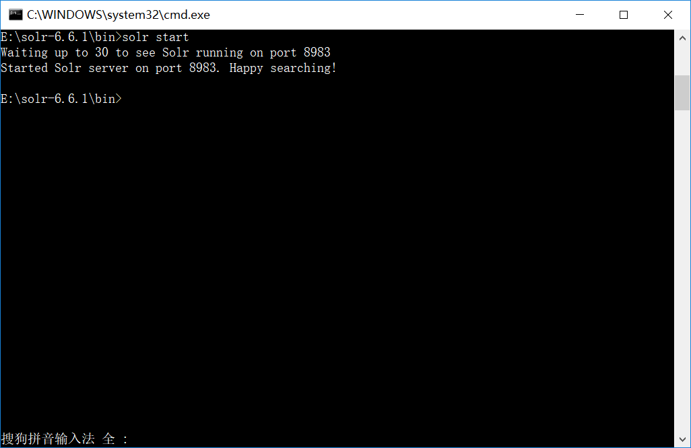
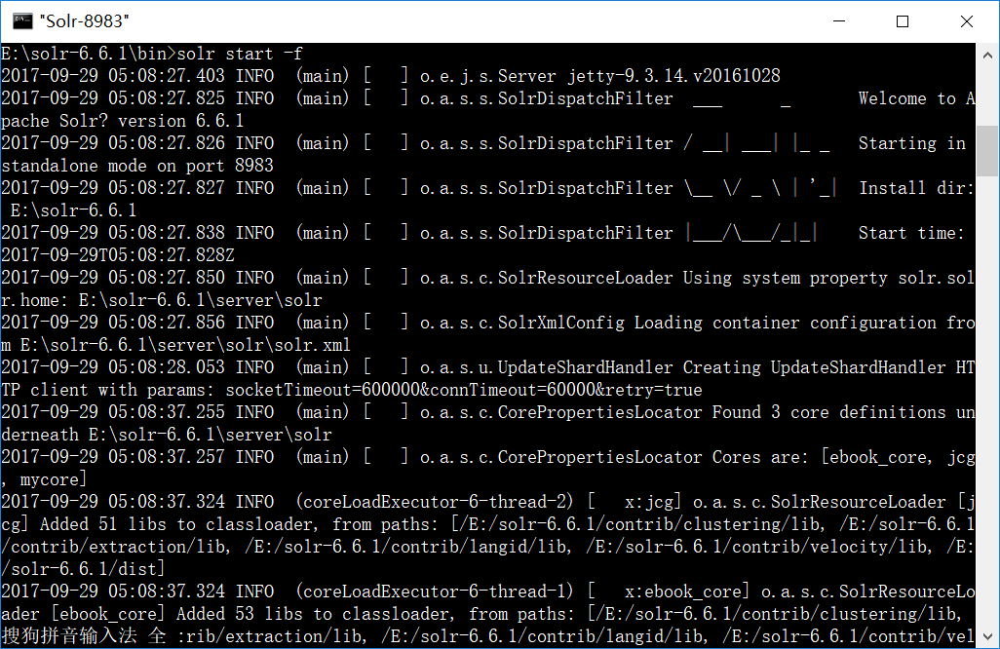
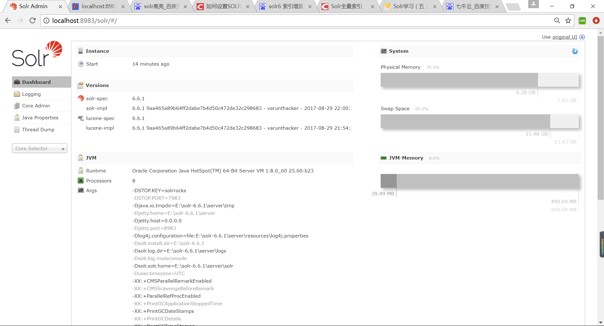
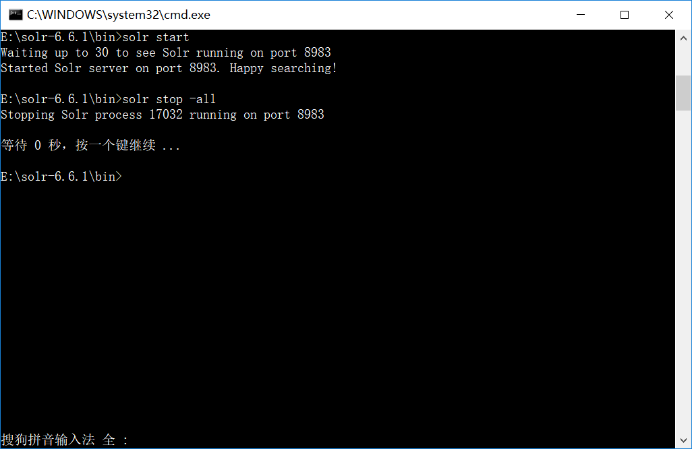

# 在Windows系统上安装Solr
#### solr介绍
      Solr 是Apache下的一个顶级开源项目，采用Java开发，它是基于Lucene的全文搜索服务器。Solr提供了比Lucene更为丰富的查询语言，同时实现了可配置、可扩展，并对索引、搜索性能进行了优化。
        Solr可以独立运行，运行在Jetty、Tomcat等这些Servlet容器中，Solr 索引的实现方法很简单，用 POST 方法向 Solr 服务器发送一个描述 Field 及其内容的 XML 文档，Solr根据xml文档添加、删除、更新索引 。Solr 搜索只需要发送 HTTP GET 请求，然后对 Solr 返回Xml、json等格式的查询结果进行解析，组织页面布局。Solr不提供构建UI的功能，Solr提供了一个管理界面，通过管理界面可以查询Solr的配置和运行情况。

#### 配置Java环境
solr是一个基于Java语言的全文检索服务器，需要安装jdk，solr6.0以上版本需要jdk1.8，配置jdk网上教程

#### 下载解压solr：
- 访问Apache Solr的主页，然后点击下载按钮或直接访问：http://lucene.apache.org/solr/downloads.html 。
- 选择一个镜像以获取Apache Solr。从那里选择下载名称为Solr-6.6.1.zip的文件。
- 将文件从下载文件夹移动到所需的目录并解压缩，在这个示例中，我们解压到E:\solr-6.6.1目录下。
假设您也将下载了Solr文件将其解压到E:\solr-6.6.1目录下。

#### 启动服务
solr解压包中自带了jetty容器，直接使用自带的jetty启动服务，在这种情况下，可以按照以下方式启动Solr，进入solr文件夹下的bin目录里，使用**solr start**开启服务，如下面的屏幕截图所示：
</img>
前台启动solr，使用**solr start -f**，可以在控制台查看输出信息：
</img>
**solr start -p port**，可以指定在端口port启动。默认的端口是8983

> 也可以使用tomcat，具体操作如下
1. 将solr-6.6.1下的service下的solr-webapp复制到Tomcat 下的webapp下，并改名solr（名字随意）；
1. 将solr-5.5.3下的service下的lib下的ext下的所有jar包复制到Tomcat下solr下web-inf下lib下；
1. 在Tomcat下solr下web-inf创建classes文件夹，并把solr5.5.3下的solr-5.5.3\solr-5.5.3\example\resources下的log4.perportiy复制到classes文件下；
到此，启动Tomcat，可以正常访问solr了，localhost:8080/solr/index.html#

#### 打开浏览器查看
要验证安装，请在浏览器中使用以下URL。
http://localhost:8983/

如果安装过程成功，那么将看到Apache Solr用户界面的仪表板，如下所示
</img>

#### 关闭solr
**solr stop**关闭服务，使用 **solr stop -all** 关闭所有solr服务
</img>

#### 重启服务
solr restart 用于重启solr服务

