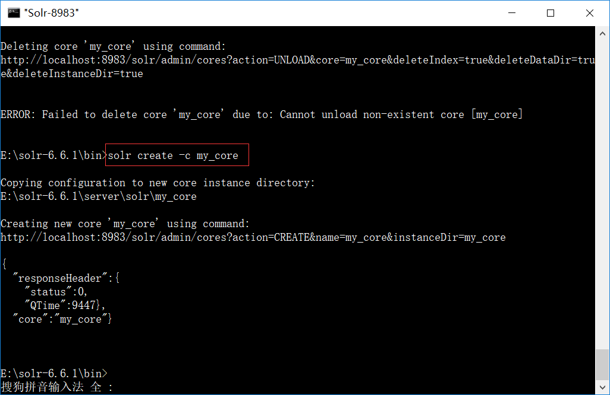
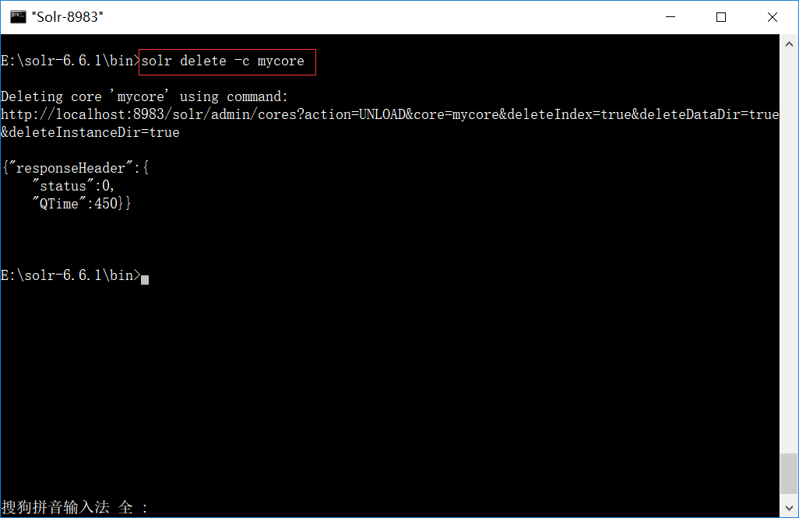

# solr core介绍及其配置文件
## Solr核心介绍
### core说明
Solr核心(Core)是Lucene索引的运行实例，包含使用它所需的所有Solr配置文件。我们需要创建一个Solr Core来执行索引和分析等操作。

Solr应用程序可以包含一个或多个核心。 如果需要，Solr应用程序中的两个核心可以相互通信。
### 创建核心
使用 **solr create -c my_core** 命令，创建一个名为my_core的核心。


### 删除核心
使用 **solr delete -c my_core** 命令，删除一个名为my_core的核心


## core核心配置文件说明
打开solr-6.6.1/server/solr/my_core，查看my_core核心的文件：
- conf:是一个放置配置文件，里面有两个文件solrconfig.xml、managed-schema需要经常修改。 
- data:是索引数据的保存目录。 
- core.properties:当前core的属性文件。

### managed-schema说明
schema.xml 文件里面主要定义了索引数据类型，索引字段等信息。
1. fieldtype

fieldtype 节点主要用来定义数据类型。
```xml
<fieldType name="string" sortMissingLast="true" class="solr.StrField"/>  
<!--booleantype:"true"or"false"-->   
<fieldType name="boolean" sortMissingLast="true" class="solr.BoolField"/>  
```
属性说明:

- name指定的是节点定义的名称
- class 指向 org.apache.solr.analysis 中定义的类型名称

fieldtype 还可以自己定义当前类型建立索引和查询数据的时候使用的查询分析器。

tokenizer 指定分词器 filter 指定过滤器
```xml
<fieldType name="text_general" class="solr.TextField" positionIncrementGap="100" multiValued="true">  
    <analyzer type="index">  
        <tokenizer class="solr.StandardTokenizerFactory"/>  
        <filter class="solr.StopFilterFactory" ignoreCase="true" words="stopwords.txt" />  
        <!-- in this example, we will only use synonyms at query time  
        <filter class="solr.SynonymFilterFactory" synonyms="index_synonyms.txt" ignoreCase="true" expand="false"/>  
        -->  
        <filter class="solr.LowerCaseFilterFactory"/>  
    </analyzer>  
    <analyzer type="query">  
        <tokenizer class="solr.StandardTokenizerFactory"/>  
        <filter class="solr.StopFilterFactory" ignoreCase="true" words="stopwords.txt" />  
        <filter class="solr.SynonymFilterFactory" synonyms="synonyms.txt" ignoreCase="true" expand="true"/>  
        <filter class="solr.LowerCaseFilterFactory"/>  
    </analyzer>  
</fieldType>  
```
属性说明：

- positionIncrementGap：可选属性，定义在同一个文档中此类型数据的空白间隔，避免短语匹配错误。positionIncrementGap=100 只对 multiValue=true 的 fieldType 有意义。

solr.TextField 允许用户通过分析器来定制索引和查询，分析器包括一个分词器 （tokenizer）和多个过滤器（filter）但StrField 类型不被分析，而是被逐字地索引/存储 

2. field

```xml
    <field name="id" type="string" indexed="true" stored="true" required="true" multiValued="false" />
    <!-- doc values are enabled by default for primitive types such as long so we don't index the version field  -->
    <field name="_version_" type="long" indexed="false" stored="false"/>
    <field name="_root_" type="string" indexed="true" stored="false" docValues="false" />
    <field name="_text_" type="text_general" indexed="true" stored="false" multiValued="true"/>

    <!--自定义的属性-->
    <field name="cat" type="text_general" indexed="true" stored="true"/>  
    <field name="name" type="text_general" indexed="true" stored="true"/>  
    <field name="price" type="double" indexed="true" stored="true"/>  
    <field name="inStock" type="boolean" indexed="true" stored="true"/>  
    <field name="author" type="text_general" indexed="true" stored="true"/> 
```

说明：
- field 节点指定建立索引和查询数据的字段。 
- name 代表数据字段名称 type 代表数据类型，也就是之前定义的 fieldtype
- indexed 代表是否被索引 
- stored 代表是否被存储 
- multiValued 是否有多个值，如果字段可能有多个值，尽可能设为 true
- required 是否必须，一般主键是设置为true的

**_version_ 节点和 _root_ 节点是必须保留的，不能删除**

3. copyfield

通过这个节点，可以把一个字段的值复制到另一个字段中，也可以把多个字段的 值同时复制到另一个字段中，这样搜索的时候都可以根据一个字段来进行搜索。
```xml
<copyField source="ProductCode" dest="text"/>  
<pre name="code" class="html"/>  
<field name="product_keywords" type="text_general" indexed="true" stored="false" multiValued="true"/>  
<copyField source="product_name" dest="product_keywords"/>  
<copyField source="product_description" dest="product_keywords"/>  
<copyField source="product_catalog_name" dest="product_keywords"/>  
```

4. dynamicField

dynamicField 表示动态字段，可以动态定义一个字段，只要符合规则的字段都可 以。
```xml
<!-- *_i 只要以_i 结尾的字段都满足这个定义 -->
<dynamicField name="*_i" stored="true" indexed="true"type="int"/>
```

5. uniquekey

uniquekey 节点是文档的唯一标示，相当于主键，每次更新，删除的时候都根据 这个字段来进行操作。必须填写。
```xml
    <uniqueKey>id</uniqueKey>
```

6. defaultSearchField

defaultSearchField 指定搜索的时候默认搜索字段的值。

```xml
<defaultSearchField>text</defaultSearchField>
```

7. solrQueryParser

solrQueryParser 指定搜索时多个词之间的关系，可以是 or,and 两种。

```xml
<solrQueryParser defaultOperator="OR"/>
```

8. 性能优化

- 将所有只用于搜索的，而不需要作为结果的 field（特别是一些比较大的 field） 的 stored 设置为 false；
- 将不需要被用于搜索的，而只是作为结果返回的field的indexed设置为false； 
- 删除所有不必要的 copyField 声明为了索引字段的最小化和搜索的效率； 
- 将所有的 textfields 的 index 都设置成 false，然后使用 copyField 将他们都复 制到一个总的 textfield 上，然后进行搜索。


### solrconfig.xml说明

solrconfig.xml 配置文件主要定义了 SOLR 的一些处理规则，包括索引数据的存放 位置，更新，删除，查询的一些规则配置。

1. datadir 节点

定义了索引数据和日 志文件的存放位置

```xml
<dataDir>${solr.data.dir:d:/Server/Solr/data}</dataDir> 
```

2. luceneMatchVersion

表示solr底层使用的是lucene4.10

```xml
<luceneMatchVersion>4.10.1</luceneMatchVersion> 
```

3. lib

表示solr引用包的位置, 当 dir 对应的目录不存在时候，会忽略此属性，regex正则表达式

```xml
<lib dir="../../../contrib/extraction/lib"regex=".*\.jar"/> 
```
4. directoryFactory

索引存储方案，共有以下存储方案 

配置 | 说明
---|---
solr.StandardDirectoryFactory | 这是一个基于文件系统存储目录的工厂，它会试 图选择最好的实现基于你当前的操作系统和 Java 虚拟机版本。
solr.SimpleFSDirectoryFactory | 适用于小型应用程序，不支持大数据和多线程。
solr.NIOFSDirectoryFactory | 适用于多线程环境，但是不适用在 windows 平台 （很慢），是因为 JVM 还存在 bug。
solr.MMapDirectoryFactory | 这个是 solr3.1 到 4.0 版本在 linux64 位系统下默认的实现。它是通过使用虚拟内存和内核特性调用 mmap 去访问存储在磁盘中 的索引文件。它允许 lucene 或 solr 直接访问 I/O 缓存。如果不需要近实时搜 索功能，使用此工厂是个不错的方案。
solr.NRTCachingDirectoryFactory | 此工厂设计目的是存储部分索引在内存中， 从而加快了近实时搜索的速度。
solr.RAMDirectoryFactory | 这是一个内存存储方案，不能持久化存储，在系统 重启或服务器 crash 时数据会丢失。且不支持索引复制


```xml
<directoryFactory class="${solr.directoryFactory:solr.NRTCachingDirectoryFactory}" name="DirectoryFactory">  
    <str name="solr.hdfs.home">${solr.hdfs.home:}</str>  
    <str name="solr.hdfs.confdir">${solr.hdfs.confdir:}</str>   
    <str name="solr.hdfs.blockcache.enabled">${solr.hdfs.blockcache.enabled:true}</str>   
    <str name="solr.hdfs.blockcache.global">${solr.hdfs.blockcache.global:true}</str>   
</directoryFactory>
```
5. codecFactory
 
编解码工厂允许使用自定义的编解码器。

例如：如果想启动 per-fieldDocValues 格式, 可以在 solrconfig.xml 里面设置 SchemaCodecFactory： docValuesFormat="Lucene42": 这是默认设置，所有数据会被加载到堆内存中。 docValuesFormat="Disk": 这是另外一个实现，将部分数据存储在磁盘上。 docValuesFormat="SimpleText": 文本格式，非常慢，用于学习。

```xml
<codecFactory class="solr.SchemaCodecFactory"/>
<schemaFactory class="ClassicIndexSchemaFactory"/>  
```

6. indexconfig

用于设置索引的低级别的属性 

配置 | 说明
---|---
`<filter class="solr.LimitTokenCountFilterFactory" maxTokenCount="10000"/>` | //限 制 token 最大长度
`<writeLockTimeout>1000</writeLockTimeout>` | //等待IndexWriter写锁定的最长时间（ms）。默认值：1000
`<maxIndexingThreads>8</maxIndexingThreads>` | 
`<useCompoundFile>false</useCompoundFile>` | //启用复合文件将使用较少的文件作为索引， 使用较少的文件描述符来降低性能。</br>//Lucene中的默认值为“true”。 Solr中的默认值为“false”（自3.6起）
`<ramBufferSizeMB>100</ramBufferSizeMB>` | //缓存
`<maxBufferedDocs>1000</maxBufferedDocs>` | //maxBufferedDocs设置 在flush前缓冲的文档数量限制</br>//同上一个设置，如果两个同时设置，哪个最先触及到限制，则哪个生效
`<mergePolicyFactory class="org.apache.solr.index.TieredMergePolicyFactory"><int name="maxMergeAtOnce">10</int><int name="segmentsPerTier">10</int><double name="noCFSRatio">0.1</double></mergePolicyFactory>` | //合并策略。
`<mergeFactor>10</mergeFactor>` | //合并因子,每次合并多少个 segments。
`<mergeScheduler class="org.apache.lucene.index.ConcurrentMergeScheduler"/>` | //合并调度器。
`<lockType>${solr.lock.type:native}</lockType>` | //锁方式。 设置索引库的锁方式，主要有三种：</br> single：适用于只读的索引库，即索引库是定死的，不会再更改 </br> native：使用本地操作系统的文件锁方式，不能用于多个 solr 服务共用同一个 索引库。Solr3.6 及后期版本使用的默认锁机制。 </br> simple：使用简单的文件锁机制
`<unlockOnStartup>false</unlockOnStartup>` | //是否启动时先解锁。 
`<termIndexInterval>128</termIndexInterval>` | //Lucene loadsterms intomemory 间隔
`<reopenReaders>true</reopenReaders>` | //重新打开,替代先关闭-再打开。
`<deletionPolicy class="solr.SolrDeletionPolicy"><strname="maxCommitsToKeep">1</str><strname="maxOptimizedCommitsToKeep">0</str> <str name="maxCommitAge">30MINUTES</str><!--<str name="maxCommitAge">1DAY</str>--></deletionPolicy>` | //提交删除策略,必须实现 org.apache.lucene.index.IndexDeletionPolicy</br>//maxCommitsToKeep 要保留的提交点的数量 </br>//maxOptimizedCommitsToKeep  要保存的优化提交点的数量</br>// maxCommitAge 一旦达到给定年龄，就删除所有提交点。  支持DateMathParser语法
`<infoStream file="INFOSTREAM.txt">false</infoStream>` | //相当于把创建索 引时的日志输出。

7. updateHandler

```xml
<updateLog> <str name="dir">${solr.ulog.dir:}</str> </updateLog>
```
设置索引库更新日志，默认路径为 solrhome 下面的 data/tlog。
随着索引库的频 繁更新，tlog 文件会越来越大，所以建议提交索引时采用硬提交方式 <autoCommit>，即批量提交。
```xml
<autoCommit>  
  <maxTime>15000</maxTime>   
  <maxDocs>10000</maxDocs>   
  <openSearcher>false</openSearcher>   
</autoCommit>  
```

自动硬提交方式:
- maxTime：设置多长时间提交一次 
- maxDocs：设置达到多少文档 提交一次 
- openSearcher：文档提交后是否开启新的 searcher,如果 false，文档只是 提交到 index 索引库，搜索结果中搜不到此次提交的文档；如果 true，既提交到 index索引库，也能在搜索结果中搜到此次提交的内容。

完整的updateHandler配置如下:
```xml
<updateHandler class="solr.DirectUpdateHandler2">  
   
    <!-- 允许事务日志 -->  
     <updateLog>  
      <str name="dir">${solr.ulog.dir:}</str>  
     </updateLog>  
   
    <!-- 在满足一定条件时自动提交。maxDocs/maxTime/openSearcher -->  
    <autoCommit>  
       <maxTime>15000</maxTime>  
       <openSearcher>false</openSearcher>  
     </autoCommit>  
   
     <!--  软提交 VS 硬提交 -->  
     <!--  
      <autoSoftCommit>   
         <maxTime>1000</maxTime>   
       </autoSoftCommit>  
      -->  
   
     <!-- 更新相关事件监听器   
     postCommit-firedaftereverycommitoroptimizecommand postOptimize-firedaftereveryoptimizecommand -->  
     <!-- The RunExecutableListener executes an external command from a  
          hook such as postCommit or postOptimize.  
            
          exe - the name of the executable to run  
          dir - dir to use as the current working directory. (default=".")  
          wait - the calling thread waits until the executable returns.   
                (default="true")  
          args - the arguments to pass to the program.  (default is none)  
          env - environment variables to set.  (default is none)  
       -->  
    <!-- This example shows how RunExecutableListener could be used  
          with the script based replication...  
          http://wiki.apache.org/solr/CollectionDistribution  
       -->  
     <!--  
        <listener event="postCommit" class="solr.RunExecutableListener">  
         <str name="exe">solr/bin/snapshooter</str>  
          <str name="dir">.</str>  
          <bool name="wait">true</bool>  
          <arr name="args"> <str>arg1</str> <str>arg2</str> </arr>  
          <arr name="env"> <str>MYVAR=val1</str> </arr>  
        </listener>  
       -->  
   
</updateHandler>  
```

8. Query 查询

```xml
<maxBooleanClauses>1024</maxBooleanClauses>
```
设置 boolean 查询中，最大条件数。在范围搜索或者前缀搜索时，会产生大量的 boolean 条件，如果条件数达到这个数值时，将抛出异常，限制这个条件数，可 以防止条件过多查询等待时间过长。
```xml
<filterCache class="solr.FastLRUCache" size="512" initialSize="512" autowarmCount="0"/>  
<queryResultCache class="solr.LRUCache" size="512" initialSize="512" autowarmCount="0"/>  
<documentCache class="solr.LRUCache" size="512" initialSize="512" autowarmCount="0"/>  
<queryResultMaxDocsCached>200</queryResultMaxDocsCached>  
<maxWarmingSearchers>2</maxWarmingSearchers>  
```

9. RequestDispatcher 请求转发器

```xml
<!--RequestDispatcher 主要是介绍当有请求访问 SolrCore 时 SolrDispatchFilter 如何处理。
handleSelect 是一个以前版本中遗留下来的属性,会影响请求的对应行为（比 如/select?qt=XXX）。
当 handleSelect="true"时导致 SolrDispatchFilter 将请求转发给 qt 指定的处理 器（前提是/select 已经注册）。
当 handleSelect="false"时会直接访问/select,若/select 未注册则为 404。 -->
<requestDispatcher handleSelect="false">
     <!--RequestParsing：请求解析 这些设置说明 SolrRequests 如何被解析,以及对 ContentStreams 有什么 限制。
     enableRemoteStreaming- 是否允许使用stream.file和stream.url参数来 指定远程 streams。
     multipartUploadLimitInKB- 指定多文件上传时 Solr 允许的最大的 size。
     formdataUploadLimitInKB- 表单通过 POST 请求发送的最大 size -->
     <requestParsers enableRemoteStreaming="true" multipartUploadLimitInKB="2048000" formdataUploadLimitInKB="2048"/>
     <!--HTTPCaching 设置 HTTP 缓存的相关参数。 -->
     <httpCaching never304="true"/>
     <!-<httpCachingnever304="true">
     <cacheControl>max-age=30,public</cacheControl>
     </httpCaching> -->
     <!-
     <httpCachinglastModifiedFrom="openTime" etagSeed="Solr">
     <cacheControl>max-age=30,public</cacheControl>
     </httpCaching> -->
</requestDispatcher>
```


