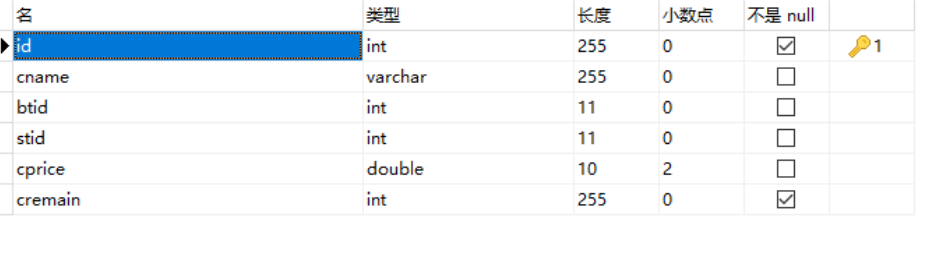
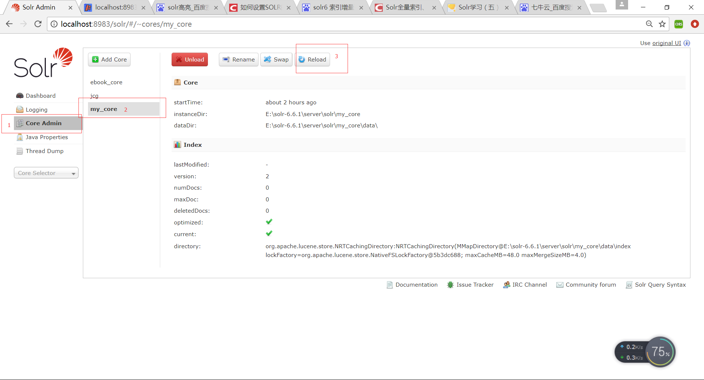
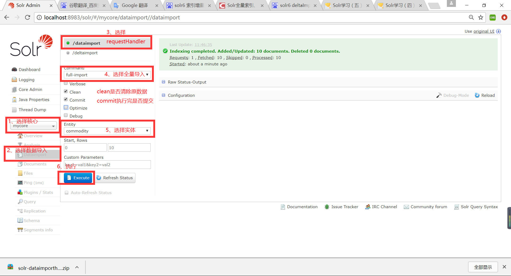
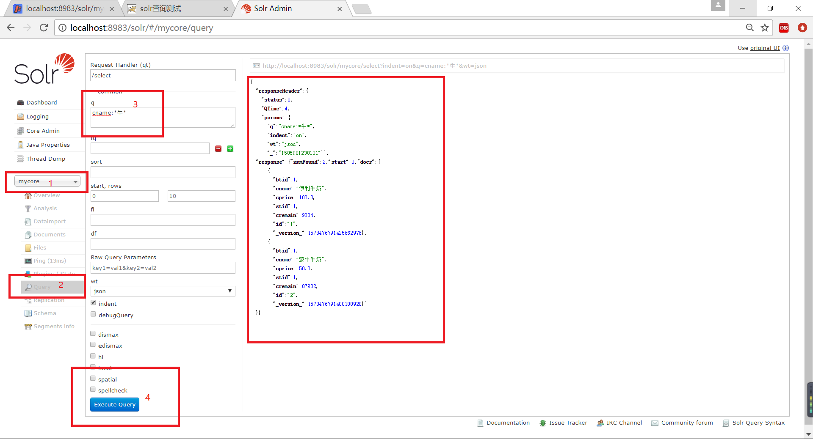

# solr配置core核心

### 一、数据库创建表

创建商品表commodity


### 二、创建核心并配置
1. 使用solr create -c my_core创建核心


2. 配置solrconfig.xml

下面列出配置solrconfig.xml文件的具体步骤，对于具体情况和其他配置参数说明请查看配置文件说明一文。

打开Solr中核心core的conf文件夹下的配置文件solrconfig.xml，加入一个请求处理者配置

```xml
<!--引入DataImportHandler类的jar,solr-dataimporthandler-6.6.1.jar和solr-dataimporthandler-extras-6.6.1.jar存放在solr-6.6.1/dist文件夹下-->
<lib dir="${solr.install.dir:../../../..}/dist/" regex="solr-dataimporthandler-.*\.jar" />
<requestHandler name="/dataimport" class="org.apache.solr.handler.dataimport.DataImportHandler">  
    <lst name="defaults">  
        <str name="config">data-config.xml</str>   
    </lst>  
  </requestHandler>
```

3. 配置data-config.xml

在solrconfig.xml同级目录下新建数据库连接配置文件data-config.xml

```xml
<?xml version="1.0" encoding="UTF-8"?>
<dataConfig>
    <!-- 数据库连接信息，类型、驱动、url、用户、密码等-->
    <dataSource type="JdbcDataSource" driver="com.mysql.jdbc.Driver" url="jdbc:mysql://localhost:3306/testdb" user="root" password="sr107"/>
　　<document name="hjx">
        <!-- 配置实体，对应数据库中的表，多表连接中可以在entry标签中使用再使用entry标签-->
        <!-- query相当于数据库查询语句-->
        <entity name="commodity" pk="id" query="select id,cname,btid,stid,cprice,cremain from commodity">
            <!-- column对应数据库表中的列,name对应managed-schema.xml中配置的field中的name-->
            <field column="id" name="id" />
            <field column="cname" name="cname" />
            <field column="btid" name="btid" />
            <field column="stid" name="stid" />
            <field column="cprice" name="cprice" />
			<field column="cremain" name="cremain" />
        </entity>
    </document>
</dataConfig>
```

4. 配置managed-schema.xml

```xml
  <field name="btid" type="int" indexed="true" stored="true"/>
  <field name="cname" type="string" indexed="true" stored="true"/>
  <field name="cprice" type="double" indexed="true" stored="true"/>
  <field name="cremain" type="int" indexed="true" stored="true"/>
  <field name="id" type="string" multiValued="false" indexed="true" required="true" stored="true"/>
  <field name="stid" type="int" indexed="true" stored="true"/>
```
说明：
- type 对应fieldType标签设置的name
- name 与data-config.xml中的name一致
- indexed 是否索引
- stored 是否存储，如果是false则是只用做索引，不存储显示。
其他标签的详细配置参见配置文件说明一文

5. 加入JDBC驱动

将MySQL的JDBC驱动加入到solr-6.6.1/server/lib文件夹


### 三、测试全量导入索引数据

1. 启动solr

在solr6.6.1/bin目录下使用命令 solr start

如果在修改core配置文件之前已经启动了solr，可以使用core admin 中reload重新载入配置文件。


2. 打开http://localhost:8983



3. 导入成功后，可以查询查看是否导入数据

