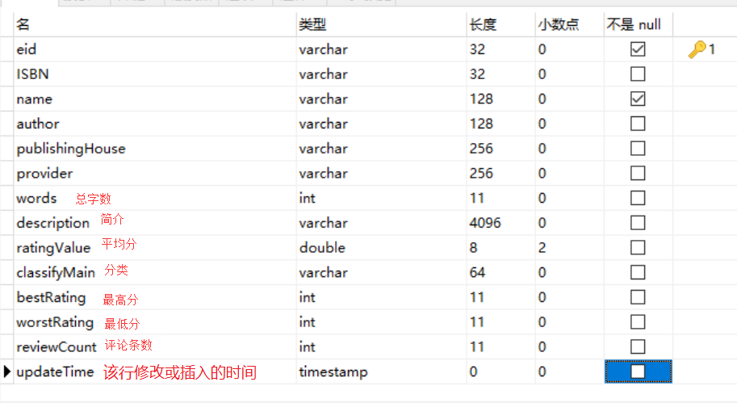
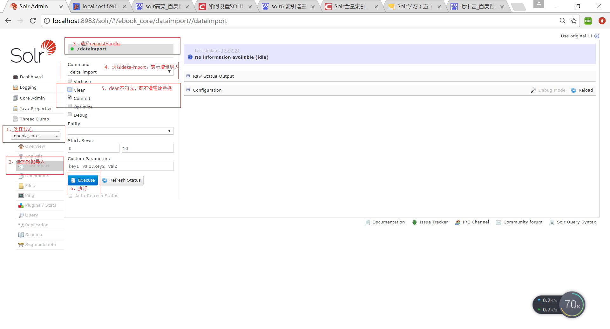
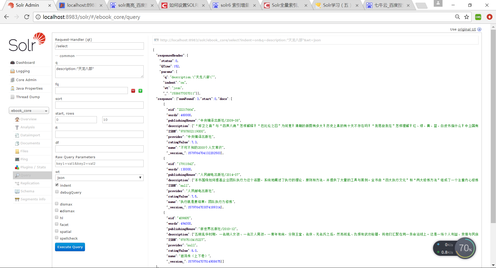

# 一、Solr全量导入

全量导入可以查看 `3. solr配置核心核心`一文，其配置步骤就是全量导入的步骤

# 二、增量导入

### 1、修改数据库
创建好了一个ebook的表，表示电子书，这里为了能够进行增量导入，需要新增一个字段，类型为TIMESTAMP，默认值为CURRENT_TIMESTAMP。

有了这样一个字段，Solr才能判断增量导入的时候，哪些数据是新的。
因为Solr本身有一个默认值last_index_time，记录最后一次做full import或者是delta import(增量导入）的时间，这个值存储在文件conf目录的dataimport.properties文件中。

### 2、配置managed-schema

```xml
<!--自定义ebook电子书-->
<field name="eid" type="string" indexed="true" stored="true" required="true" multiValued="false" />
<field name="ISBN" type="string" indexed="true" stored="true"/>
<field name="name" type="string" indexed="true" stored="true" required="true" multiValued="false" />
<field name="author" type="string" indexed="true" stored="true"/>
<field name="publishingHouse" type="string" indexed="true" stored="true" required="true" multiValued="false" />
<field name="provider" type="string" indexed="true" stored="true"/>
<field name="words" type="int" indexed="false" stored="true" required="true" multiValued="false" />
<field name="description" type="text_general" indexed="true" stored="true"/>
<field name="ratingValue" type="double" indexed="true" stored="true" required="true" multiValued="false" />
<field name="updateTime" type="date" indexed="true" stored="true" />

<!--修改uniqueKey为主键eid-->
<uniqueKey>eid</uniqueKey>
```

### 3、配置solrconfig.xml

```xml
<!--引入DataImportHandler类的jar-->
<lib dir="${solr.install.dir:../../../..}/dist/" regex="solr-dataimporthandler-.*\.jar" />

<requestHandler name="/dataimport" class="org.apache.solr.handler.dataimport.DataImportHandler">
  <lst name="defaults">
    <str name="config">data-config.xml</str>
  </lst>
</requestHandler>
```

### 4、配置data-config.xml

```xml
<?xml version="1.0" encoding="UTF-8"?>
<dataConfig>
    <dataSource type="JdbcDataSource" driver="com.mysql.jdbc.Driver" url="jdbc:mysql://localhost:3306/testdb" user="root" password="sr107"/>
　　<document name="hjx">
        <entity name="commodity" pk="id" query="select * from ebook"
			deltaImportQuery="select * from ebook where id='${dih.delta.id}'"
			deltaQuery="select id from ebook where updateTime>'${dataimporter.last_index_time}'"
            transformer="RegexTransformer">
            <field column="eid" name="eid" />
            <field column="ISBN" name="ISBN" />
            <field column="name" name="name" />
            <field column="author" name="ahthor" />
            <field column="publishingHouse" name="publishingHouse" />
			<field column="provider" name="provider" />
			<field column="words" name="words" />
			<field column="description" name="description" />
			<field column="ratingValue" name="ratingValue" />
            <field column="updateTime" name="updateTime" />
        </entity>
    </document>
</dataConfig>
```
解读：
```xml
1、首先按照query指定的SQL语句查询出符合条件的记录。
2、然后从这些数据中根据deltaQuery指定的SQL语句查询出所有需要增量导入的数据的ID号。
3、最后根据deltaImportQuery指定的SQL语句返回所有这些ID的数据，即为这次增量导入所要处理的数据。
核心思想是：通过内置变量“${dih.delta.id}”和 “${dataimporter.last_index_time}”来记录本次要索引的id和最近一次索引的时间。
注意：刚新加上的UpdateTime字段也要在field属性中配置，同时也要在schema.xml文件中配置：<field name="updateTime" type="date" indexed="true" stored="true" />
```

### 3、增量导入数据

打开localhost:8983



可以查询查看是否导入数据




