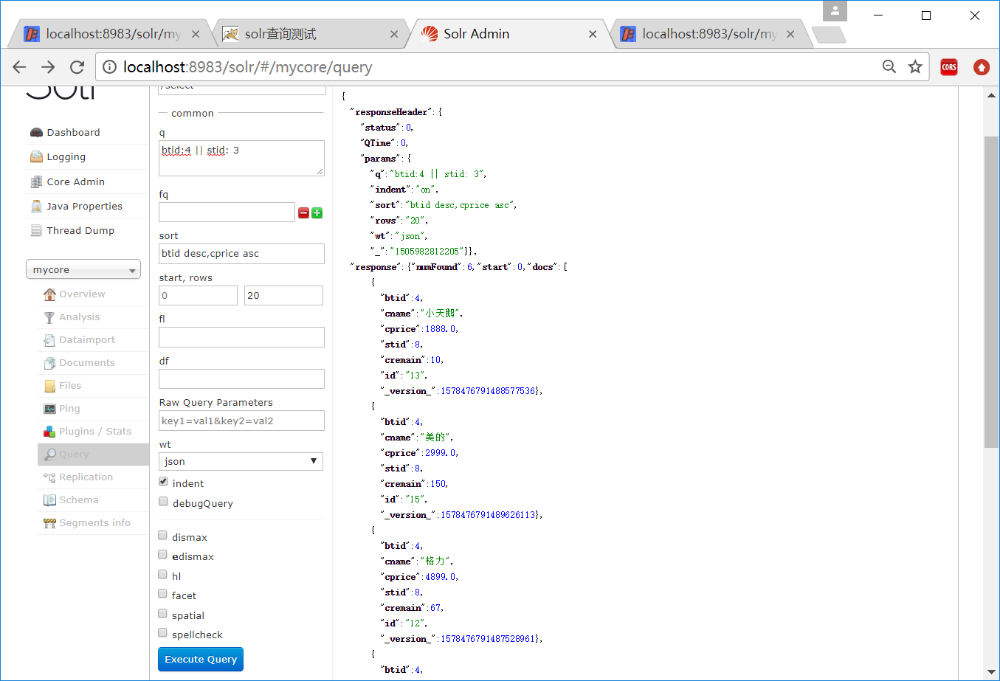
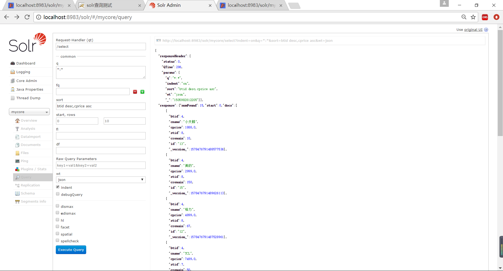

# solr高级查询

## 检索运算符
```
: 指定字段查指定值，如返回所有值:

? 表示单个任意字符的通配

* 表示多个任意字符的通配（不能在检索的项开始使用*或者?符号）

~ 表示模糊检索，如检索拼写类似于"roam"的项这样写：roam~将找到形如foam和roams的单词；roam~0.8，检索返回相似度在0.8以上的记录。 邻近检索，如检索相隔10个单词的"apache"和"jakarta"，"jakarta apache"~10

^ 控制相关度检索，如检索jakarta apache，同时希望去让"jakarta"的相关度更加好，那么在其后加上""符号和增量值，即jakarta4 apache

布尔操作符AND、&&
布尔操作符OR、||
布尔操作符NOT、!、-（排除操作符不能单独与项使用构成查询）
+ 存在操作符，要求符号"+"后的项必须在文档相应的域中存在
() 用于构成子查询
[] 包含范围检索，如检索某时间段记录，包含头尾，date:[200707 TO 200710]
{}不包含范围检索，如检索某时间段记录，不包含头尾，date:{200707 TO 200710}
" 转义操作符，特殊字符包括+ - && || ! ( ) { } [ ] ^ " ~ * ? : "
```
## q代表query input 必须输入
查询url：
```
http://localhost:8983/solr/mycore/select?indent=on&q=cname:*牛*&wt=json
```
输出数据格式
```json
{
  "responseHeader":{
    "status":0,
    "QTime":3,
    "params":{
      "q":"cname:*牛*",
      "indent":"on",
      "wt":"json",
      "_":"1505982812205"}},
  "response":{"numFound":2,"start":0,"docs":[
      {
        "btid":1,
        "cname":"伊利牛奶",
        "cprice":100.0,
        "stid":1,
        "cremain":9884,
        "id":"1",
        "_version_":1578476791425662976},
      {
        "btid":1,
        "cname":"蒙牛牛奶",
        "cprice":50.0,
        "stid":1,
        "cremain":87902,
        "id":"2",
        "_version_":1578476791480188928}]
  }
}
```


## fl 限定输出结果的内容
查询url：
```
http://localhost:8983/solr/mycore/select?indent=on&q=cname:*牛*&fl=cname,cprice&wt=json
```
输出数据格式
```json
{
  "responseHeader":{
    "status":0,
    "QTime":1,
    "params":{
      "q":"cname:*牛*",
      "indent":"on",
      "fl":"cname,cprice",
      "wt":"json"}},
  "response":{"numFound":2,"start":0,"docs":[
      {
        "cname":"伊利牛奶",
        "cprice":100.0},
      {
        "cname":"蒙牛牛奶",
        "cprice":50.0}]
  }
}
```

## start和row
>start设置从第几条显示<br/>
>row设置查询几条记录<br/>
>相当于MySQL中的 limit start_num,row_num<br/>
>预设是查询从0到10的数据
>
solrj中使用
```java
SolrQuery params=new SolrQuery();
params.setQuery(condition+":"+str);
//从第几条开始显示数据
params.setStart(5);
//显示几条数据
params.setRows(5);
```

## sort – 排序
>格式：sort=<field name>+<desc|asc>[,<field name>+<desc|asc>]… 。示例：（inStock desc, price asc）表示先 “inStock” 降序, 再 “price” 升序，默认是相关性降序。
>

solrj中示例

```java
SolrQuery params=new SolrQuery();
params.setQuery("*:*");
params.setSort("btid", ORDER.desc);
//或者addSort(...)添加多个排序
//params.addSort("btid", ORDER.desc);
//params.addSort("cprice",ORDER.asc);
```

## fq – （filter query）过虑查询
>作用：在q查询符合结果中同时是fq查询符合的，
>
>例如：q=mm&fq=date_time:[20081001 TO 20091031]，找关键字mm，并且date_time是20081001到20091031之间的

## wt - (writer type)指定输出格式
>可以有 xml, json, php, phps。

## indent 是否缩进输出
>json,php,phps,ruby输出才有必要用这个参数
>
>代表输出的xml或json数据格式要不要缩行,缩行后更容易查看,相当于格式化输出.>
>
>预设为开启 on


## facet 构面

类似SQL中的group by，在Apache Solr中的构面或分组(faceting)指的是将搜索结果分类到各种类别中。

Apache Solr中可用的faceting类型 -</br>
   查询faceting - 返回当前搜索结果中与给定查询匹配的文档数。</br>
   日期faceting - 它返回在特定日期范围内的文档数。
   
构面或分组(faceting)命令被添加到任何正常的Solr查询请求，并且faceting计数在同一个查询响应中返回。

