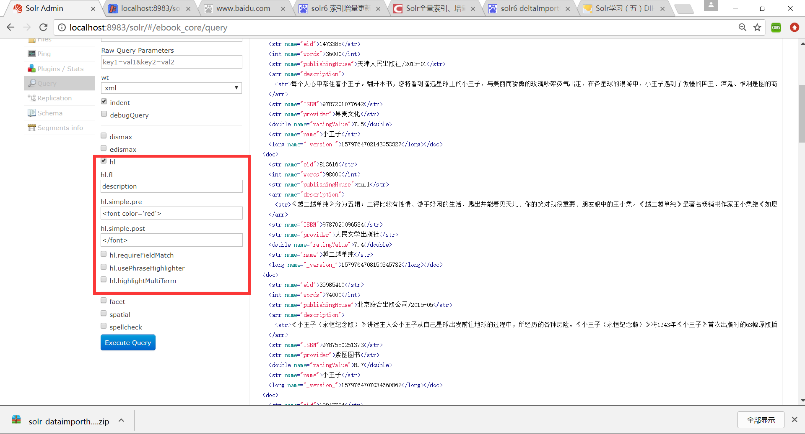

# solr高亮显示

</img>

>hl.fl: 需要高亮的字段，用空格或逗号隔开的字段列表。要启用某个字段的highlight功能，就得保证该字段在schema中是stored。如果该参数未被给出，那么就会高亮默认字段 standard handler会用df参数，dismax字段用qf参数。你可以使用星号去方便的高亮所有字段。如果你使用了通配符，那么要考虑启用
hl.requiredFieldMatch选项。
>
>hl.simple.pre:  
高亮字段添加的字符串前缀，例如设置h1.simple.pre=``，即在检索匹配的字段前面加上该前缀。
>
>hl.simple.post:  
高亮字段添加的字符串后缀，例如设置h1.simple.post=``，与h1.simple.pre对应，即在检索匹配的字段设置红色醒目提醒。
>
>hl.requireFieldMatch:  
如果置为true，除非该字段的查询结果不为空才会被高亮。它的默认值是false，意味着它可能匹配某个字段却高亮一个不同的字段。如果hl.fl使用了通配符，那么就要启用该参数。尽管如此，如果你的查询是all字段（可能是使用copy-field 指令），那么还是把它设为false，这样搜索结果能表明哪个字段的查询文本未被找到
>
>hl.usePhraseHighlighter: 
如果一个查询中含有短语（引号框起来的）那么会保证一定要完全匹配短语的才会被高亮。例如：q=description:"小王子"时是查询description中包含短语"小王子"的记录，可以看到查询到的记录条数比q=description=小王子查询的记录条数要少。
>
>hl.highlightMultiTerm: 
如果使用通配符和模糊搜索，那么会确保与通配符匹配的term会高亮。默认为false，同时hl.usePhraseHighlighter要为true。
>
以下是不常用的设置:
>hl.snippets
这是highlighted片段的最大数。默认值为1，也几乎不会修改。如果某个特定的字段的该值被置为0（如f.allText.hl.snippets=0），这就表明该字段被禁用高亮了。你可能在hl.fl=*时会这么用。
>
>hl.fragsize: 
每个snippet返回的最大字符数。默认是100.如果为0，那么该字段不会被fragmented且整个字段的值会被返回。大字段时不会这么做。
>
>hl.mergeContiguous: 
如果被置为true，当snippet重叠时会merge起来。
>
>hl.maxAnalyzedChars: 
会搜索高亮的最大字符，默认值为51200，如果你想禁用，设为-1
>
>hl.alternateField: 
如果没有生成snippet（没有terms 匹配），那么使用另一个字段值作为返回。
>
>hl.maxAlternateFieldLength: 
如果hl.alternateField启用，则有时需要制定alternateField的最大字符长度，默认0是即没有限制。所以合理的值是应该为
hl.snippets * hl.fragsize这样返回结果的大小就能保持一致。
>
>hl.formatter:一个提供可替换的formatting算法的扩展点。默认值是simple，这是目前仅有的选项。显然这不够用，你可以看看org.apache.solr.highlight.HtmlFormatter.java 和 solrconfig.xml中highlighting元素是如何配置的。 
注意在不论原文中被高亮了什么值的情况下，如预先已存在的em tags，也不会被转义，所以在有时会导致假的高亮。
>
>hl.fragmenter: 
这个是solr制定fragment算法的扩展点。gap是默认值。regex是另一种选项，这种选项指明highlight的边界由一个正则表达式确定。这是一种非典型的高级选项。为了知道默认设置和fragmenters (and formatters)是如何配置的，可以看看solrconfig.xml中的highlight段。 
>
>regex 的fragmenter有如下选项：
hl.regex.pattern:正则表达式的pattern
hl.regex.slop:这是hl.fragsize能变化以适应正则表达式的因子。默认值是0.6，意思是如果hl.fragsize=100那么fragment的大小会从40-160.
