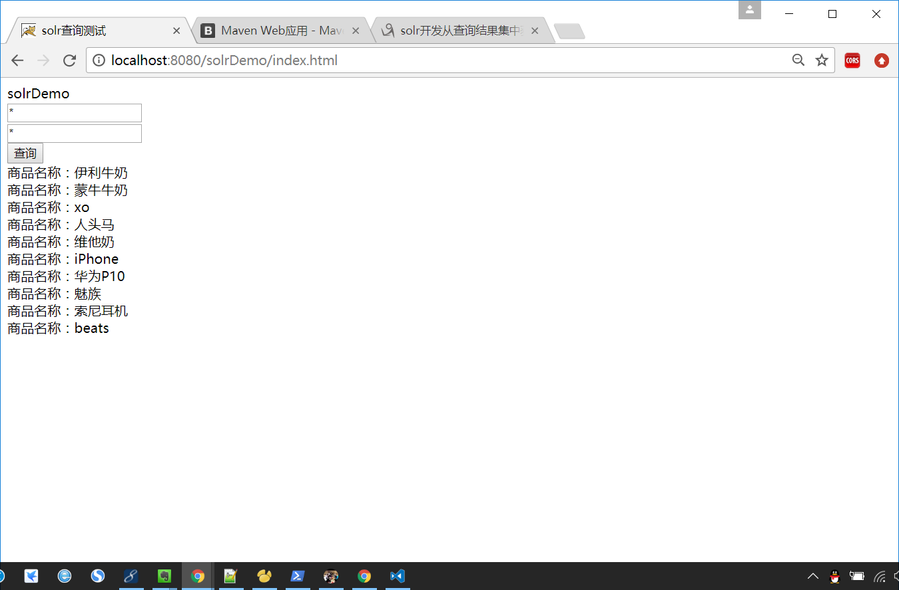

# Solr和Spring整合

1. 使用Maven构建web项目
2. Maven中配置Spring依赖项
3. Maven中配合Solr依赖项
4. 配置httpSolrServer的bean

## 使用Maven构建web项目
详情参见Maven构建Eclipse web项目一文 [链接] https://app.yinxiang.com/shard/s66/nl/17718832/b1c611f5-c152-4cca-b807-3e7ba8653558

## Maven中配置Spring依赖项
在Maven项目中pom.xml文件中加入依赖
```xml
<!-- Spring 版本 -->
<properties>
  	<springVersion>4.3.11.RELEASE</springVersion>
</properties>
<!-- Spring web 依赖项 -->
<dependency>
    <groupId>org.springframework</groupId>
    <artifactId>spring-web</artifactId>
    <version>${springVersion}</version>
</dependency>
<dependency>
    <groupId>org.springframework</groupId>
    <artifactId>spring-webmvc</artifactId>
    <version>4.3.11.RELEASE</version>
</dependency>
```


## Maven中配置Solr的项目依赖
在Maven项目中pom.xml文件中加入依赖
```xml
<!-- solr客户端solrj的依赖项 -->
<dependency>
    <groupId>org.apache.solr</groupId>
    <artifactId>solr-solrj</artifactId>
    <version>4.10.1</version>
</dependency>
```

## 在applicationContext.xml中配置solr的Server的bean
```xml
<!-- 读取solr配置文件 -->
<bean id="propertyConfigurer" class="org.springframework.beans.factory.config.PropertyPlaceholderConfigurer">
    <property name="locations">
        <list>
            <value>classpath:solr.properties</value>
        </list>
    </property>
</bean>

<!--定义solr的Server,5.0以上版本没有httpSolrServer,只有HttpSolrClient，两个的功能相同,知识底层的实现方式不同，方法也不同-->  
<bean id="httpSolrServer" class="org.apache.solr.client.solrj.impl.HttpSolrServer">  
    <constructor-arg name="baseURL" value="${solr.url}"/>
    <!-- 设置响应解析器 -->    
    <property name="parser">  
        <bean class="org.apache.solr.client.solrj.impl.XMLResponseParser"/>
    </property>
    <!-- 建立连接的最长时间 -->  
    <property name="connectionTimeout" value="${solr.connectionTimeout}"/>  
</bean>  
```
solr的配置文件solr.properties，可以存放httpSolrServer的配置项
```java
## solr服务器的地址
solr.url=http://localhost:8983/solr/mycore
## 建立链接的最长时间
solr.connectionTimeout=500
## 设置重试次数 
solr.maxRetries=1
```
## 测试
mycore核心中已经建立了Commodity商品的索引，我们使用这个核心来索引搜索商品


### 首先编写commodity的实体类
```java
package com.todaytech.entity;

import org.apache.solr.client.solrj.beans.Field;
import org.springframework.beans.factory.annotation.Autowired;

public class Commodity {
    private Integer id;
    //上文配置的solr的查询结果集维xml格式数据,使用Field注解的形式,转换成commodity对象
    @Field("cname")
    private String cname;

    @Field
    private Integer btid;

    private Integer stid;

    private Double cprice;

    private Integer cremain;

    @Override
	public String toString() {
		return "Commodity [id=" + id + ", cname=" + cname + ", btid=" + btid
				+ ", stid=" + stid + ", cprice=" + cprice + ", cremain="
				+ cremain + "]";
	}

	public Integer getId() {
        return id;
    }

    public void setId(Integer id) {
        this.id = id;
    }

    public String getCname() {
        return cname;
    }

    public Commodity(){}
    public Commodity(Integer id, String cname, Integer btid, Integer stid,
			Double cprice, Integer cremain) {
		this.id = id;
		this.cname = cname;
		this.btid = btid;
		this.stid = stid;
		this.cprice = cprice;
		this.cremain = cremain;
	}

	public void setCname(String cname) {
        this.cname = cname == null ? null : cname.trim();
    }

    public Integer getBtid() {
        return btid;
    }

    public void setBtid(Integer btid) {
        this.btid = btid;
    }

    public Integer getStid() {
        return stid;
    }

    public void setStid(Integer stid) {
        this.stid = stid;
    }

    public Double getCprice() {
        return cprice;
    }

    public void setCprice(Double cprice) {
        this.cprice = cprice;
    }

    public Integer getCremain() {
        return cremain;
    }

    public void setCremain(Integer cremain) {
        this.cremain = cremain;
    }


}
```
### 编写solr搜索的controller
注意这里的controller返回的是json格式的数据,需要导入json的解析包
```java
package com.todaytech.controller;

import java.io.IOException;
import java.util.HashMap;
import java.util.Iterator;
import java.util.List;
import java.util.Map;

import org.apache.solr.client.solrj.SolrQuery;
import org.apache.solr.client.solrj.SolrServerException;
import org.apache.solr.client.solrj.impl.HttpSolrServer;
import org.apache.solr.client.solrj.response.QueryResponse;
import org.springframework.beans.factory.annotation.Autowired;
import org.springframework.stereotype.Controller;
import org.springframework.web.bind.annotation.RequestMapping;
import org.springframework.web.bind.annotation.ResponseBody;

import com.todaytech.entity.Commodity;

@Controller
public class SolrController {

	@Autowired  
    private HttpSolrServer httpSolrServer;
	
	@RequestMapping("/solrTest.do")
	@ResponseBody
	public Object solrTest(String condition,String str){
		System.out.println(condition+" "+str);
		SolrQuery params=new SolrQuery();
		params.setQuery("*:"+"*");
		try {
			QueryResponse queryResponse =httpSolrServer.query(params);
			System.out.println(queryResponse.toString());
			List<Commodity> commoditys=queryResponse.getBeans(Commodity.class);
			for(Commodity commodity:commoditys){
				System.out.println(commodity);
			}
			return commoditys;
		} catch (SolrServerException e) {
			e.printStackTrace();
			return "SolrServerException";
		}
	}
	
}
```
### 测试页面代码
```html
<!DOCTYPE html>
<html>
<head>
<meta charset="utf-8">
<base> solrDemo</base>
<title>solr查询测试</title>
<script type="text/javascript" src="plugins/jquery.js"></script>
<script>
	$(document).ready(function(){
		$("#query").click(function(){
			var condition=$("#condition").val();
			var str=$("#str").val();
			var url="http://localhost:8080/solrDemo/solrTest.do?condition="+condition+"&str="+str;
			$.get(url,function(data){
				$.each(data,function(key,value){$("#result").append("商品名称："+value.cname+"<br/>");});
			})
		});
	});
</script>
</head>
<body>
	<form action="solrTest.do">
		<input type="text" id="condition" value="*"/><br/>
		<input type="text" id="str" value="*"/><br/>
		<input type="button" id="query" value="查询"/>
	</form>
	<div id="result"></div>
</body>
</html>
```
### 运行结果
